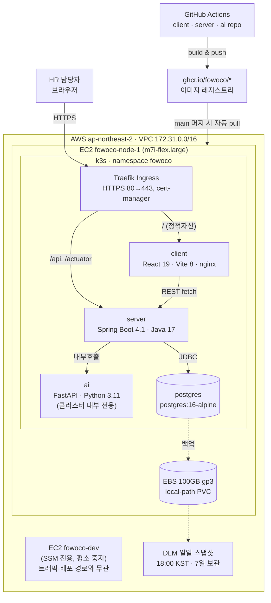

## 한눈에 보기

- 클라우드: **AWS ap-northeast-2 (Seoul)**
- 오케스트레이션: **k3s 단일 노드** (EC2 `fowoco-node-1`, m7i-flex.large, 2 vCPU/8GiB)
- 저장소: `client`(React), `server`(Spring Boot), `ai`(FastAPI), `infra`(이 저장소)
- 이미지 레지스트리: GHCR (`ghcr.io/fowoco/*`, Public 필수)
- 도메인: `fowoco.3.35.105.80.nip.io` + cert-manager/Let's Encrypt로 실제 HTTPS 인증서 자동 발급
- **`client`/`server`/`ai` 전부 실배포·라이브 상태**, 셋 다 GitHub Actions self-heal 배포 (push마다 자동 `kubectl apply` + `set image`)

## 아키텍처



## 라우팅

| 경로 | 대상 | 비고 |
|---|---|---|
| `/` | `client` (nginx) | SPA catch-all |
| `/api` | `server` (:8080) | REST API |
| `/actuator` | `server` (:8080) | health/metrics |
| (없음) | `ai` (:8000) | 외부 미노출, `server`만 내부 호출 |

## 배포 파이프라인

```
push to main → GitHub Actions
  → docker build & push (ghcr.io/fowoco/<repo>:latest, :<sha>)
  → kubectl apply -f infra/k8s/*.yaml  (self-heal bootstrap)
  → kubectl set image deployment/<repo> ...
  → rollout status 확인
```

## 모니터링

- `monitoring` 네임스페이스 — `fowoco`와 완전히 분리, self-heal 배포 파이프라인과 무관(수동 `kubectl apply`).
- Prometheus가 `node-exporter`(EC2 노드 리소스) · `kube-state-metrics`(파드/Deployment 상태) · `server`의 기존 `/actuator/prometheus` · `kube-apiserver`를 스크레이핑.
- Grafana: `https://grafana.3.35.105.80.nip.io` (letsencrypt-prod ClusterIssuer 재사용).
- `grafana-admin` Secret은 git에 커밋하지 않는다. 배포 전 직접 생성:
  ```
  kubectl create secret generic grafana-admin -n monitoring \
    --from-literal=GF_SECURITY_ADMIN_USER=admin \
    --from-literal=GF_SECURITY_ADMIN_PASSWORD='<strong-random-password>'
  ```
- 배포 순서: `kubectl apply -f infra/k8s/monitoring/` (00~06 번호 순서대로 적용됨).

## 백업 / 복구

- EBS 100GB(`vol-001d68981ae503c1b`) 매일 18:00 KST DLM 스냅샷, 7일 보관.
- 2026-08-13 실제 복구 드릴 완료 — PostgreSQL 16 데이터 디렉터리 정상, 문서 파일 확인. 

## 비용

- `m7i-flex.large` 온디맨드 $0.11771/hr. `fowoco-node-1`은 24/7, `fowoco-dev`는 인프라 검증 시에만 기동.

