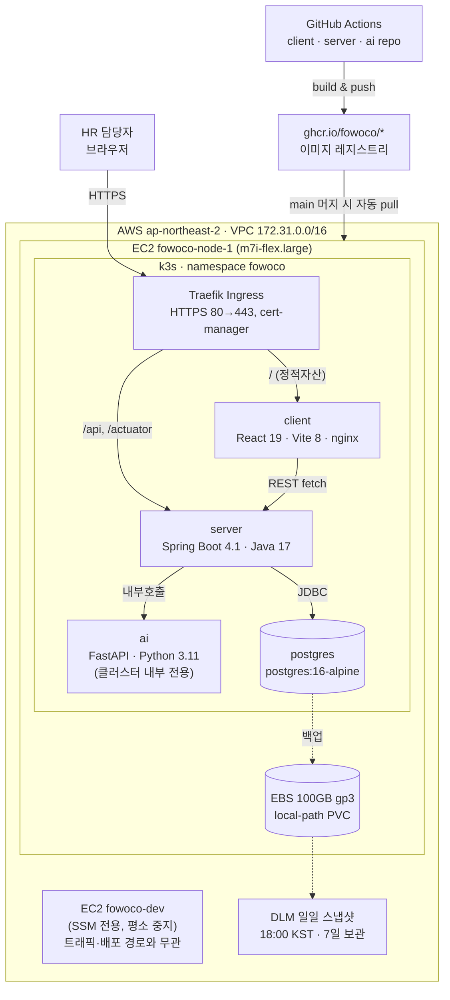

# FOWOCO Infra

최종 갱신: 2026-08-14

## 한눈에 보기

- 클라우드: **AWS ap-northeast-2 (Seoul)**
- 오케스트레이션: **k3s 단일 노드** (EC2 `fowoco-node-1`, m7i-flex.large, 2 vCPU/8GiB)
- 저장소: `client`(React), `server`(Spring Boot), `ai`(FastAPI), `infra`(이 저장소)
- 이미지 레지스트리: GHCR (`ghcr.io/fowoco/*`, Public 필수)
- 도메인: `fowoco.3.35.105.80.nip.io` + cert-manager/Let's Encrypt로 실제 HTTPS 인증서 자동 발급
- **`client`/`server`/`ai` 전부 실배포·라이브 상태**, 셋 다 GitHub Actions self-heal 배포 (push마다 자동 `kubectl apply` + `set image`)

## 아키텍처



## 왜 이 구조인가

- `server`는 마이크로서비스가 아니라 **모듈러 모놀리스** — 배포 단위가 client/server/ai/postgres 4개뿐이라 무거운 오케스트레이션이 불필요.
- Postgres는 매니지드 서비스 대신 **클러스터 안에 직접 운영** — AWS 크레딧으로 비용 압박이 없어서 "전부 우리 인프라 안에서" 원칙 유지.
- `ai`는 외부 노출 없이 **`server`가 클러스터 내부 DNS로만 호출**. Ingress에 `/ai` 경로 자체가 없음.

## 라우팅

| 경로 | 대상 | 비고 |
|---|---|---|
| `/` | `client` (nginx) | SPA catch-all |
| `/api` | `server` (:8080) | REST API |
| `/actuator` | `server` (:8080) | health/metrics |
| (없음) | `ai` (:8000) | 외부 미노출, `server`만 내부 호출 |

## 배포 파이프라인

```
push to main → GitHub Actions
  → docker build & push (ghcr.io/fowoco/<repo>:latest, :<sha>)
  → kubectl apply -f infra/k8s/*.yaml  (self-heal bootstrap)
  → kubectl set image deployment/<repo> ...
  → rollout status 확인
```

- `client`/`ai`/`server` 셋 다 self-heal 방식 적용 완료.
- GitHub Actions 러너(고정 IP 아님)가 EC2 퍼블릭 IP:6443으로 직접 `kubectl` 접속 — 그래서 보안그룹 6443은 `0.0.0.0/0`으로 열려 있음. k3s API 서버 자체가 TLS client-cert 인증을 요구해서, 포트가 열려 있어도 유효한 kubeconfig 없이는 접근 불가 (알려진 트레이드오프, IP가 고정인 self-hosted runner로 옮기기 전까진 유지).

## 보안 / 계정 설정

| 항목 | 상태 |
|---|---|
| CloudTrail | ✅ 활성화 (`fowoco-trail`, 멀티리전, 로그 무결성 검증) |
| 비용 알람 | ✅ AWS Budgets `fowoco-monthly-cost` (월 $50 기준, 50/80/100%+예측초과 시 이메일) |
| 루트/IAM MFA | ❌ 미설정 — 사람이 직접 인증 앱으로 등록해야 함 |
| IAM 비밀번호 정책 | ❌ 미설정 (AWS 기본값) |
| `fowoco-sg` 인바운드 | 80, 443, 6443 → `0.0.0.0/0`. SSH(22)는 닫혀 있음 |
| `fowoco-dev-sg` | 인바운드 없음 — SSM 전용 |
| 프로덕션 모니터링 | ❌ 없음 — server가 `/actuator/prometheus`로 지표는 내보내지만 클러스터에 Prometheus/Grafana 미배포 |
| 이미지 태그 | `:latest` 고정 — SHA 태그 전환 권장 |
| `ai`/`client` 브랜치 보호 | `ai`는 미설정, `client`는 CI 필수만 있고 리뷰 승인 요구 없음. `server`만 완비 |

## 백업 / 복구

- EBS 100GB(`vol-001d68981ae503c1b`) 매일 18:00 KST DLM 스냅샷, 7일 보관.
- 2026-08-13 실제 복구 드릴 완료 — PostgreSQL 16 데이터 디렉터리 정상, 문서 파일 확인. **오래된 스냅샷은 리사이즈 이전 30GB로 복구된다는 점 주의**.

## 노드 용량

- `m7i-flex.large` 실사용량 여유 있음 (CPU 3%, requests 32.5%). `limits` 합계 100%는 CPU 오버커밋이 정상인 것뿐, 즉시 조치 불요.

## 비용

- `m7i-flex.large` 온디맨드 $0.11771/hr. `fowoco-node-1`은 24/7, `fowoco-dev`는 인프라 검증 시에만 기동.

## 알려진 개선 과제

1. `ai` 저장소 브랜치 보호 설정
2. `client` 브랜치 보호에 리뷰 승인 요구 추가
3. 프로덕션 클러스터에 Prometheus/Grafana 배포
4. 배포 이미지 태그를 `:latest` → SHA/버전 태그로 전환
5. 루트 + IAM 사용자 MFA 등록
6. IAM 비밀번호 정책 설정

배포 매니페스트 자체는 `k8s/` 디렉터리 참고.
